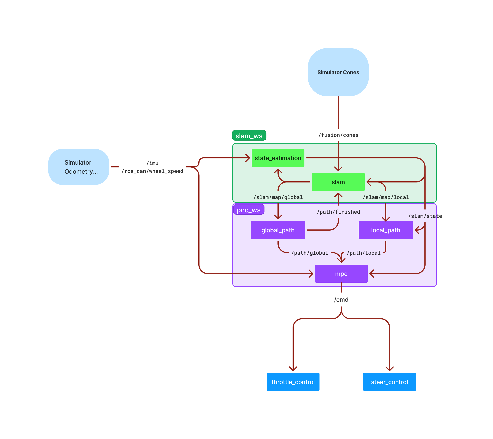

.. Pipeline 131 documentation master file, created by
   sphinx-quickstart on Thu Sep  5 20:44:40 2024.
   You can adapt this file completely to your liking, but it should at least
   contain the root `toctree` directive.

Pipeline 131 documentation
==========================
Welcome to the Formula Electric at Berkeley Pipeline 131 Mk.S documentation! 
This site is meant to document our codebase that works on the `Endinburgh University Simulator <https://gitlab.com/eufs/eufs_sim>`_

The event broadly consists of the car driving through a previously unseen track, made up of blue and yellow cones, with the blue cones indicating the left side of the track, and the yellow cones indicating the right side of the track.

Our code utilizes a 'Discovery Lap', where the car drives through the first lap carefully, and creates a global map of cones, while navigating on a local map and local path. Once the car finishes creating a global map, it creates the optimal global path through the entire track, and begins driving **much much harder** 
Since we don't run perception, our pipeline on the simulator is more condensed, and consists of path-planning, localization, and control algorithms, depicted below:

.. toctree::
   :maxdepth: 1
   :caption: Contents:

   modules

Thank Yous:

* This was a **Massive** project, that would not have been possible without our entire team working **incredibly hard** over the course of many years. 
* This documentation site was also inspired by CMU Racing, in an effort to assist other driverless teams in getting started.
* A huge thank you to our sponsors (insert sponsors stuff).
